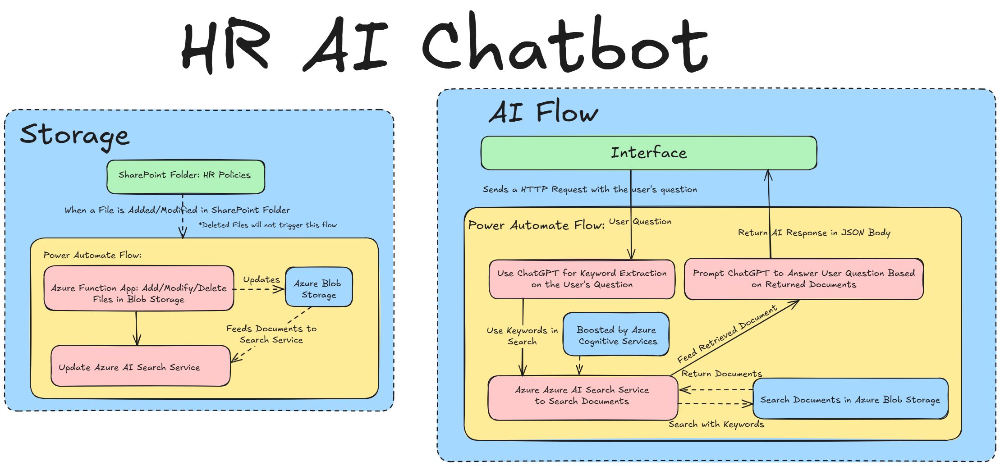

# Azure HR Copilot – RAG Architecture

## 📌 Overview
**Azure HR Copilot** is an AI-powered chatbot that provides instant, grounded answers to HR policy and procedure questions.  
It uses a **Retrieval-Augmented Generation (RAG)** architecture built on Azure AI services, with secure, enterprise-ready integration and low-code orchestration.

This **public-safe replica** uses synthetic HR documents to demonstrate the same architecture and workflow used in production.

---

## 🏗 Architecture


**Workflow:**
1. **Power Automate Flow** detects new HR documents in SharePoint.
2. Documents are sent to **Azure Blob Storage**.
3. **Azure Function App** splits PDFs into **page-level documents** for cost-efficient semantic search.
4. **Azure AI Search** indexes each page for precise retrieval.
5. **Azure OpenAI Service** (GPT-3.5/4 Turbo) uses RAG to ground answers in indexed content.
6. Responses are delivered to users via **Power Automate** and **Copilot Studio**.

---

## ⚙️ Tech Stack
- **Azure Blob Storage** – document storage
- **Azure AI Search** – indexing & semantic retrieval
- **Azure OpenAI Service** – GPT-3.5/4 Turbo for generative responses
- **Power Automate** – low-code orchestration
- **Azure Function App** – PDF ingestion & page-splitting
- **SharePoint** – HR document source
---

## 📄 Project Notes
This function set was originally implemented at **Affirma Consulting** for an HR department.

- **Delete Function (`delete-pdf-pages`)**: Fully tested and working, but **not integrated into the Power Automate flow** because the HR department’s process did not involve automated deletion of documents.  
- **Split Function (`split-pdf`)**: Supports replacement by automatically deleting any existing page blobs before uploading new ones — ensuring storage stays clean.

This design allows you to:
- Run `delete-pdf-pages` manually when needed (via HTTP POST)
- Keep the Power Automate workflow simpler for teams that do not need automated deletion

---

## 🚀 Setup & Installation

### Prerequisites
- Azure subscription
- Azure OpenAI resource with GPT-3.5/4 Turbo deployment
- Azure AI Search resource
- Azure Blob Storage container
- Power Automate environment

### 1. Clone the Repo
```bash
git clone https://github.com/yourusername/azure-hr-copilot-rag.git
cd azure-hr-copilot-rag
